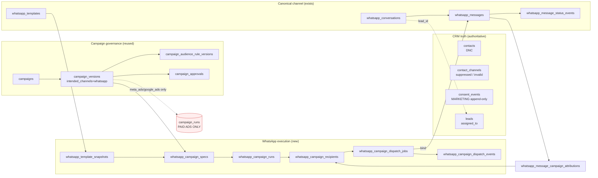
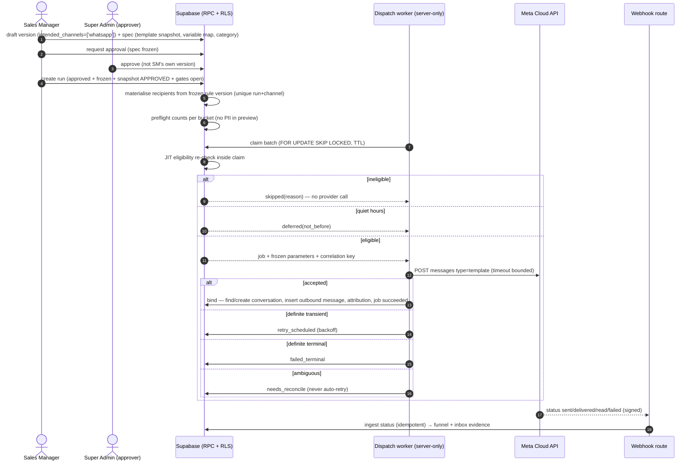
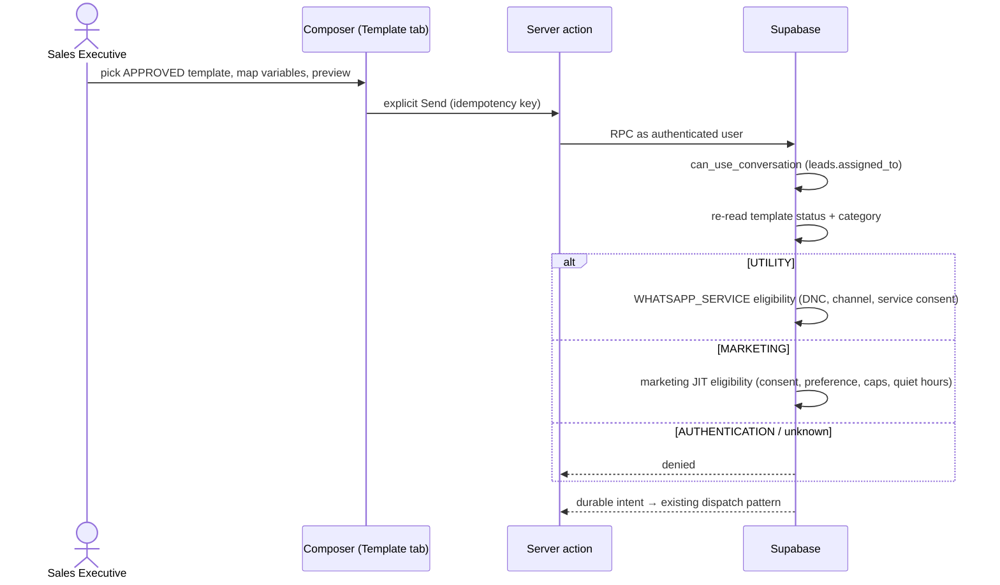
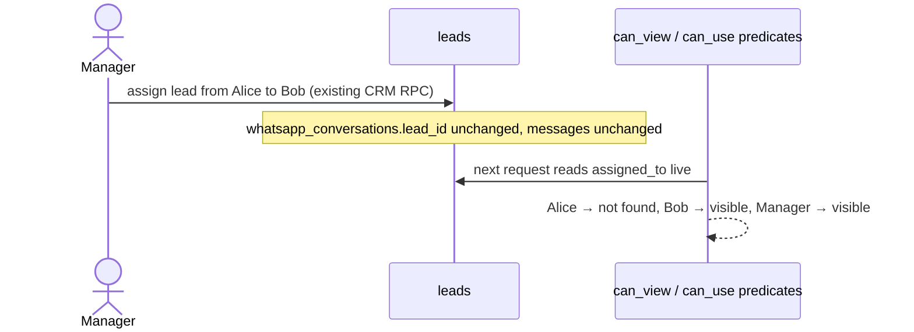
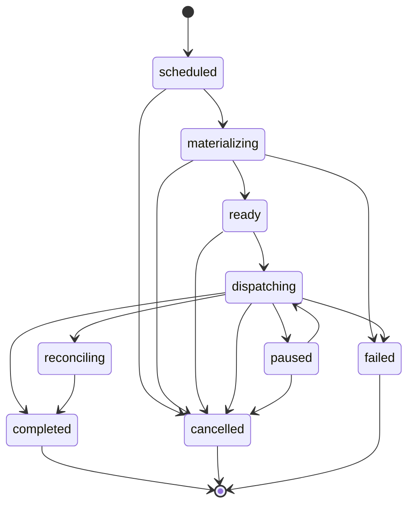
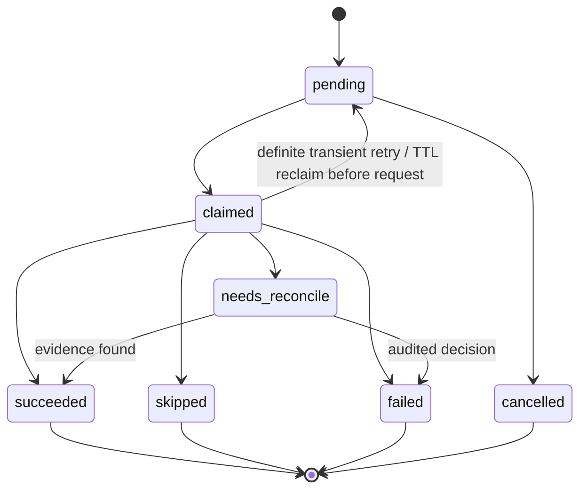

# ONEDECORE — WhatsApp Marketing Control Plane (Master Plan)

- **Architecture:** [ADR-0034](../ADR/ADR-0034-complete-whatsapp-marketing-control-plane-and-crm-owned-conversation-access.md) · **Decision:** DEC-0100
- **Phase:** WM-0 architecture freeze (this document). WM-1…WM-7 implement it.
- **Baseline:** `origin/main` `9a782ad5bed148d4e0ee92b26c76193d4fe5a995` (PR #186 premium inbox merged)
- **Code twin:** `src/features/whatsapp-marketing/contracts/*`, `src/features/whatsapp/contracts/{conversation-ownership,template-registry,staff-conversation-state}.ts`
- **Contract tests:** `npm run test:wm-0`
- **Production:** OFF. Repository build is never activation; live Meta outbound stays owner-gated (P9, [docs/11](../11-accelerated-closeout-roadmap.md)).

No secret value appears in this document.

---

## 1. Current truth (audited at WM-0)

| Area | What exists | Where |
| --- | --- | --- |
| Webhook ingestion | HMAC-verified, hash/event-key idempotent, cross-WABA fail-closed; `event_kind` in `inbound_message`, `message_status`, `unsupported` | M18 `20260804150000`, `src/app/api/webhooks/meta/whatsapp/route.ts`, `src/features/whatsapp/server/meta-webhook-*` |
| Canonical history | `whatsapp_conversations` (phone number + customer E.164 unique; nullable `contact_id`, `lead_id`), `whatsapp_messages` (unique `provider_message_id`, `context_provider_message_id`), append-only `whatsapp_message_status_events` | M18 |
| Template registry | `whatsapp_templates` exists, **metadata only, never synced, never sent** (unique business account + name + language; `status` default `unknown`) | M18 |
| Inbox access | `private.whatsapp_inbox_can_view_conversation` / `…can_use_conversation` / `…actor_can_use_conversation`: lead-linked → `leads.assigned_to = auth.uid()` or manage scope; unlinked → manage scope only. `use` predicates exclude tombstoned leads | M19, M21, lead tombstone `20260906180000` |
| Read model | Authenticated SELECT policies on conversations/messages through the view predicate; repository uses the cookie client (`createClient`), not the service role | M20, `whatsapp-inbox-queries.ts` |
| Service send | `whatsapp_send_intents` CHECK `purpose_code = 'WHATSAPP_SERVICE'`; `create_whatsapp_service_send_intent` → `…_impl_v2` raises `denied_purpose`; DNC/contact/channel/consent/service-window eligibility; `template_required` outside 24h fails closed | M19, M26, lead link repair `20260902140000` |
| Dispatch | Service-role-only claim/bind/outcome/reconcile; `whatsapp_provider_dispatch_attempts`; ambiguous → reconcile; kill switch `ONEDECORE_WHATSAPP_OUTBOUND_MODE` | M21, `whatsapp-dispatch-service.ts` |
| Provider port | `WhatsappProviderAdapter.dispatchTextMessage` only; single Graph `/messages` call site in `whatsapp-meta-provider-adapter.ts` | 6B-B4 |
| Lead link | Single deterministic writer `private.crm_apply_whatsapp_conversation_lead_link`; ambiguous identities stay unlinked | `20260902140000` |
| Premium inbox | `/admin/whatsapp/inbox`, honest (no fake unread), list + thread + details + composer | PR #186 |
| Campaign governance | `campaigns`, `campaign_versions` (`intended_channels`, `targeting_mode`), `campaign_audience_rule_versions`, append-only `campaign_approvals`; SM self-approval denied in DB; permissions `campaigns.read/draft/request_approval/approve`, `marketing_consents.manage` (SA/SM) | M31 |
| Paid-ads execution | `campaign_runs` (CHECK `provider_channel in ('meta_ads','google_ads')`), `campaign_run_targets`, `campaign_run_operations`, `campaign_execution_events`; `campaigns.execute/pause/metrics.read` (SA/SM); `whatsapp`/`email` are "deferred channels" | M33, M34 |
| Consent | Append-only `consent_events` with `MARKETING` purpose; public form records only `SERVICE_ENQUIRY` + `SERVICE_COMMUNICATION` | lead intake data plane, M31 |
| Suppression | `contacts.status = 'do_not_contact'`; `contact_channels.status in ('invalid','suppressed','archived')` | lead intake data plane |
| Audience fields | `lead_source`, `lead_stage`, `service_interest`, `locality` with `equals/not_equals/in/not_in` | `src/features/marketing/contracts/audience-rule.ts` |

**Audit findings carried into WM-1:**

1. `private.whatsapp_inbox_can_view_conversation` was **not** redefined by the lead tombstone migration, while `…can_use_conversation` was. A former assignee (and manage scope) may therefore still *read* a conversation whose lead is tombstoned. It may be intended as history, but it is undocumented and untested. WM-1 must decide and cover it with a pgTAP test.
2. The inbox has no per-staff read state, so Unread and Needs Reply cannot yet be shown truthfully. PR #186 correctly shows neither.
3. `whatsapp_webhook_events.event_kind` has no template status, Flow or referral kinds. Those payloads are recorded as `unsupported` today.
4. `META_WHATSAPP_GRAPH_API_VERSION` defaults to `v22.0` in `provider-dispatch.ts`. That is a fallback default, not a requirement. Each provider-capability phase re-verifies it against current Meta documentation.

---

## 2. Navigation (target)

### Admin (`/admin/whatsapp/*`, permission-gated per entry)

| Entry | Route (target) | Phase | Offered to |
| --- | --- | --- | --- |
| Inbox | `/admin/whatsapp/inbox` | exists; WM-1 filters | inbox.read |
| Contacts | `/admin/whatsapp/contacts` | WM-3 | whatsapp.contacts.read |
| Templates | `/admin/whatsapp/templates` | WM-2 | whatsapp.templates.read |
| Campaigns | `/admin/whatsapp/campaigns` | WM-4 | campaigns.read |
| Segments | `/admin/whatsapp/segments` | WM-3 | whatsapp.segments.read |
| Automations | `/admin/whatsapp/automations` | WM-6 | whatsapp.automations.read |
| Forms / Flows | `/admin/whatsapp/flows` | WM-6 | whatsapp.flows.read |
| Analytics | `/admin/whatsapp/analytics` | WM-5 | whatsapp.analytics.read / campaigns.metrics.read |
| Settings & Compliance | `/admin/whatsapp/settings` | WM-3 | whatsapp.settings.read |

The list decides what is **offered**; each route's own server guard decides what is **allowed**.

### Future Sales Representative dashboard — "My WhatsApp"

Assigned Chats · Needs Reply · Unread · Follow-ups · My Lead Conversation. **Not designed in WM-0.** Contract in §12.

---

## 3. Actor / capability matrix

### 3.1 Summary

| Capability | Super Admin | Sales Manager / management | Sales Executive | PM / Designer | Kriti | n8n |
| --- | :-: | :-: | :-: | :-: | :-: | :-: |
| Read assigned-lead conversations | ✓ | ✓ | ✓ (current assignment only) | — | — | — |
| Read broad linked + unlinked triage | ✓ | ✓ | — | — | — | — |
| Service-window text reply | ✓ | ✓ | ✓ assigned | — | draft only | — |
| Insert approved UTILITY template (1:1) | ✓ | ✓ | ✓ assigned | — | draft only | — |
| Insert approved MARKETING template (1:1) | ✓ | ✓ | ✓ assigned, full marketing JIT checks | — | — | — |
| Record opt-out (restrictive) | ✓ | ✓ | ✓ in scope | — | — | — |
| Grant / clear MARKETING consent | ✓ | ✓ | — | — | — | — |
| Template Studio (sync/draft/submit) | ✓ | ✓ | — | — | — | — |
| Global contacts / segments | ✓ | ✓ | — | — | — | — |
| Draft campaign + request approval | ✓ | ✓ | — | — | — | — |
| Approve campaign version | ✓ | ✓ **not own** | — | — | — | — |
| Execute WhatsApp run | ✓ | ✓ (approved by another) | — | — | — | — |
| Pause / resume run | ✓ | ✓ | — | — | — | — |
| Cancel run | ✓ | — | — | — | — | — |
| Export per-recipient report | ✓ | — | — | — | — | — |
| Send-policy / execution gate settings | ✓ | read | — | — | — | — |
| Automations / Flows manage | ✓ | ✓ (activation needs approval) | — | — | — | — |

There is no "send anyway" for DNC, suppression, invalid channel, missing/withdrawn consent or opt-out for **any** actor.

### 3.2 Permission codes (frozen target; DB is authority)

Existing codes are reused; new codes are inserted only by the phase migration named.

| Code | Status | Source | Granted to | Notes |
| --- | --- | --- | --- | --- |
| `whatsapp.inbox.read` | existing | M19 | SA, SM, management, SE, sales | RLS scope = assignment / manage |
| `whatsapp.inbox.use` | existing | M19 | SA, SM, management, SE, sales | WHATSAPP_SERVICE only |
| `whatsapp.inbox.manage` | existing | M19 | SA, SM, management | broad + unlinked triage |
| `campaigns.read` | existing | M31 | SA, SM | reused |
| `campaigns.draft` | existing | M31 | SA, SM | reused; drafts version + spec |
| `campaigns.request_approval` | existing | M31 | SA, SM | reused; freezes spec |
| `campaigns.approve` | existing | M31 | SA, SM | reused; SM self-approval denied |
| `marketing_consents.manage` | existing | M31 | SA, SM | grant/withdraw evidence |
| `campaigns.execute` | existing | M33 | SA, SM | **paid ads only; not sufficient for WhatsApp** |
| `campaigns.pause` | existing | M33 | SA, SM | reused for WhatsApp pause/resume |
| `campaigns.metrics.read` | existing | M33 | SA, SM | reused for WhatsApp funnel |
| `whatsapp.templates.read` | planned | WM-2 | SA, SM | all registry rows |
| `whatsapp.templates.use` | planned | WM-2 | SA, SM, SE | approved only, conversations actor can use |
| `whatsapp.templates.manage` | planned | WM-2 | SA, SM | sync/draft/submit |
| `whatsapp.contacts.read` | planned | WM-3 | SA, SM | global contact workspace |
| `whatsapp.opt_out.record` | planned | WM-3 | SA, SM, SE | restrictive only |
| `whatsapp.segments.read` / `.manage` | planned | WM-3 | SA, SM | allowlisted rules |
| `whatsapp.settings.read` | planned | WM-3 | SA, SM | |
| `whatsapp.settings.manage` | planned | WM-3 | SA | caps, quiet hours, execution gate |
| `whatsapp.campaigns.execute` | planned | WM-4 | SA, SM | plus approved-by-another rule |
| `whatsapp.campaigns.test_send` | planned | WM-4 | SA, SM | registered internal test numbers only |
| `whatsapp.campaigns.cancel` | planned | WM-4 | SA | mirrors 9C |
| `whatsapp.analytics.read` | planned | WM-5 | SA, SM | aggregates |
| `whatsapp.reports.export` | planned | WM-5 | SA | minimised, audited |
| `whatsapp.automations.read` / `.manage` | planned | WM-6 | SA, SM | activation via approval |
| `whatsapp.flows.read` / `.manage` | planned | WM-6 | SA, SM | |

**Open owner decisions (defaults above apply unless changed):** (a) whether legacy `management`/`sales` roles receive the new WM codes (M19 mirrored them; M31 did not; default: canonical five roles only); (b) whether Sales Manager may execute WhatsApp runs or only Super Admin (default: SM may, as in 9C, because SM cannot approve their own version).

---

## 4. Module map

```
src/features/whatsapp/                      CHANNEL CORE (exists)
  contracts/   conversation-ownership  template-registry  staff-conversation-state   ← WM-0
               inbox-permissions  provider-dispatch  conversation-dtos …
  server/      webhook ingest · inbox queries (RLS) · service send · dispatch · Meta adapter
  components/  inbox (route-shell independent)

src/features/whatsapp-marketing/            MARKETING CONTROL PLANE (new in WM-0)
  contracts/   campaign-lifecycle  recipient-lifecycle  eligibility  preferences
               dispatch-outcome  capability-matrix  schema-plan
  (WM-2+)      server/ templates-sync · segments · campaign runs · dispatcher · analytics
  (WM-2+)      components/ template drawer · studio · campaigns · segments …

Reused:  src/features/marketing (campaign governance)   src/features/crm (lead truth)
```

Dependency direction: `whatsapp-marketing → whatsapp | marketing | crm`. **`whatsapp` never imports `whatsapp-marketing`** (tested). Marketing code therefore cannot reach `create_whatsapp_service_send_intent`.

---

## 5. Sequence and data diagrams

### 5.1 Data ownership



### 5.2 Bulk marketing send



### 5.3 One-to-one template insertion (WM-2)



### 5.4 CRM reassignment



---

## 6. Lifecycle state machines

### 6.1 WhatsApp campaign spec

`draft` → `frozen` when the campaign version leaves `draft`. Never edited after freeze; a change is a new version.

### 6.2 WhatsApp campaign run



Pause and cancel stop **new claims**. Claimed jobs finish and record evidence. A `reconciling` run cannot be cancelled away from its unknown outcomes.

### 6.3 Recipient

`queued` · `excluded` (preflight skip) · `sent` · `skipped` (JIT skip) · `failed` · `needs_reconcile` · `cancelled`. Delivery/read are **evidence**, joined from status events, not recipient states.

### 6.4 Dispatch job



Bounds (engineering, not business): max attempts 3, claim TTL 120s, batch ≤ 50, backoff 30s doubling to ≤ 900s, provider timeout 15s.

### 6.5 Template (registry, provider-driven)

`PENDING` → `APPROVED` | `REJECTED`; `APPROVED` → `PAUSED` | `DISABLED` | `IN_APPEAL` | `PENDING_DELETION` → `DELETED`; also `LIMIT_EXCEEDED`, `ARCHIVED`; anything unrecognised → `unknown` (raw kept, bounded). **Only `APPROVED` is sendable.** Category changes are recorded as events and re-checked at send.

### 6.6 Dispatch outcomes

| Outcome | Job state | Provider called |
| --- | --- | :-: |
| `bound` | succeeded | ✓ |
| `already_bound` | succeeded | — |
| `skipped_ineligible` | skipped | — |
| `deferred` | pending (not-before) | — |
| `retry_scheduled` | pending (backoff) | ✓ |
| `failed_terminal` | failed | ✓ |
| `needs_reconcile` | needs_reconcile | ✓ (unknown) |
| `not_claimable` / `run_not_active` / `outbound_disabled` | unchanged | — |

---

## 7. CRM reassignment model

- Authority: `public.leads.assigned_to`, joined through `whatsapp_conversations.lead_id`, evaluated per request by the M19 predicates.
- Forbidden: any owner column on conversations or read models (`assigned_sales_rep`, `owner_id`, …), caching owner in React state beyond a request, service-role reads that widen staff scope.
- Reassignment effects: old assignee sees "not found"; new assignee sees full history; manage scope unaffected; lead link unchanged; send intents created by the old assignee are re-checked at dispatch by `whatsapp_inbox_actor_can_use_conversation` and fail closed.
- Per-staff read state is keyed by `(conversation, staff)` and is **not** transferred on reassignment; the new owner starts with everything unread, which is the truthful state for them.
- Campaign messages sent to a contact whose conversation links to a lead appear in the assignee's inbox by the same rule; no campaign-specific access path exists.

---

## 8. Eligibility, consent, opt-out and policy

### 8.1 JIT precedence (first failure wins)

1. run dispatching (preview: skipped) → `run_not_active`
2. template APPROVED → `template_not_approved`
3. template category MARKETING → `template_category_not_marketing`
4. not already bound → `already_sent`
5. contact exists / not DNC / active → `contact_missing` · `contact_do_not_contact` · `contact_inactive`
6. WhatsApp channel exists / not suppressed / not invalid / active → `whatsapp_channel_missing` · `channel_suppressed` · `channel_invalid` · `channel_inactive`
7. latest MARKETING event `granted` → `marketing_consent_missing` · `_withdrawn` · `_suppressed` · `_expired`
8. category preference allowed → `preference_opted_out`
9. variables valid → `variables_missing` · `variables_invalid`
10. send policy configured → `send_policy_unconfigured`
11. frequency cap → `frequency_capped`
12. quiet hours → **defer** (`quiet_hours`)

### 8.2 Audience preview buckets (counts only, no recipient list)

total matched · eligible · missing WhatsApp · no marketing consent (incl. preference opt-out) · DNC · suppressed/invalid · frequency capped · missing variables · other.

### 8.3 Consent and preferences

- `consent_events` purpose `MARKETING`, channel `whatsapp`, append-only. Preference events narrow a grant per category: `design_inspiration`, `offers`, `project_updates`, `referral`, `educational_content`.
- No reinterpretation of consultation, `SERVICE_COMMUNICATION` or `WHATSAPP_SERVICE` consent. No backfill.
- Future public opt-in: explicit, optional, separately worded, `copy_version`/`notice_version` evidenced. Out of scope until an owner-approved legal copy exists.

### 8.4 Opt-out

- Whole-message match after NFKC, lower-case, whitespace collapse, edge punctuation strip: `stop`, `unsubscribe`, `remove me`, `no marketing`, `stop marketing`, `opt out`/`optout`. Messages over 40 characters are never auto-classified.
- Meta's marketing opt-out button reply handled by payload.
- Inbound opt-out → append `withdrawn` MARKETING event (system actor, evidence = message id), idempotent; future marketing suppressed; service replies unaffected.
- Ambiguous phrasing goes to a human (surfaced in inbox), never auto-applied.

### 8.5 Frequency caps and quiet hours

- Versioned `whatsapp_marketing_send_policies`: one or more rolling rules `{windowHours, maxMessages}`, quiet hours `{timezone (default Asia/Kolkata), start, end}`. No default numbers in code. Unconfigured → fail closed.
- Caps count **every** governed marketing send to the contact (all runs + 1:1 marketing templates).

---

## 9. Error handling and reconciliation

| Situation | Handling |
| --- | --- |
| Worker crash after claim, before provider request recorded | TTL expiry → reclaim (`claimed → pending`) |
| Worker crash after provider request recorded | TTL expiry → `needs_reconcile` |
| HTTP timeout / connection reset after send | `needs_reconcile` |
| 4xx policy / template / recipient errors | `failed_terminal` with bounded code |
| 429 / 5xx with definite error body | `retry_scheduled` until max attempts → `failed_terminal` |
| Template paused or recategorised mid-run | JIT skip `template_not_approved` / `template_category_not_marketing`; run continues skipping — operator pauses |
| Opt-out arrives mid-run | JIT skip for any unclaimed job |
| Kill switch closed mid-run | `outbound_disabled`, no state change, run stays dispatching until paused |
| Status webhook for unknown message id | persisted as today (message_id null); later bind links by provider id |
| Reconcile resolution | Evidence: status webhook carrying the job correlation key (verify official echo support in WM-4) or provider message id → `succeeded`; otherwise an audited human decision → `failed` with reason. Never re-queued. |

Evidence is never deleted to roll back. Rollback is a forward migration or a gate closure.

---

## 10. Schema plan (forward-only; nothing applied in WM-0)

### 10.1 Remains authoritative (never duplicated)

`contacts` · `contact_channels` · `consent_events` · `leads.assigned_to` · `lead_follow_ups` · `whatsapp_conversations` · `whatsapp_messages` · `whatsapp_message_status_events` · `whatsapp_templates` (extended) · `campaigns` · `campaign_versions` · `campaign_audience_rule_versions` · `campaign_approvals`.

**Not reused for WhatsApp:** `campaign_runs`, `campaign_run_targets`, `campaign_run_operations`, `campaign_execution_events`.

### 10.2 Planned objects

All new tables: RLS enabled **and forced**, no anon grants, least-privilege authenticated SELECT through scope predicates, mutations only via `SECURITY INVOKER` public wrappers over `SECURITY DEFINER` private impls with `set search_path = ''`, service-role-only worker RPCs, bounded JSON (`pg_column_size`), append-only triggers where marked.

| Phase | Object | Key shape (indicative) | Append-only |
| --- | --- | --- | :-: |
| WM-1 | `whatsapp_conversation_staff_state` | PK (conversation_id, staff_user_id); last_read_message_id, last_read_message_at, last_opened_at; RLS: own row + can_view | — |
| WM-1 | read-model RPC(s) for attention filters | SQL over RLS scope; keyset pagination | — |
| WM-2 | `whatsapp_templates` + columns | provider_status_raw, category_raw, quality_rating, parameter_format, synced_at, rejected_reason (bounded) | — |
| WM-2 | `whatsapp_template_snapshots` | template_id, components jsonb (≤16KB), components_hash unique per template, variable_schema, category, captured_at | ✓ |
| WM-2 | `whatsapp_template_status_events` | template_id, source (sync/webhook), status, category, event_key unique | ✓ |
| WM-2 | `whatsapp_template_submissions` | draft payload hash, requested_by, provider response snapshot (allowlisted) | ✓ |
| WM-2 | service intent template mode | `whatsapp_send_intents` gains nullable `template_snapshot_id` + frozen parameters; purpose CHECK **unchanged** | — |
| WM-2 | `webhook_events.event_kind` | add `template_status` (forward-only CHECK replace) | — |
| WM-3 | `whatsapp_marketing_preference_events` | contact_id, category, event_type, source, evidence | ✓ |
| WM-3 | `whatsapp_marketing_send_policies` | version, frequency_rules jsonb, quiet_hours, effective_from, set_by | ✓ (versions) |
| WM-3 | `whatsapp_segments` | name, rule_group jsonb (allowlisted AST), created_by | — |
| WM-3 | audience field allowlist | budget range, assigned representative, sales temperature, received date, last interaction, last inbound, last marketing send, consultation/quotation state | — |
| WM-4 | `whatsapp_campaign_specs` | campaign_version_id unique, template_snapshot_id, variable_mapping, preference_category, spec_hash; immutable after version submit (trigger) | — |
| WM-4 | `whatsapp_campaign_runs` | run_reference, campaign_version_id, spec_hash, audience_rule_hash, status, scheduled_for, requested_by, counts | — |
| WM-4 | `whatsapp_campaign_recipients` | run_id, contact_id, lead_id null, contact_channel_id, unique (run_id, contact_channel_id), frozen_parameters (only needed), preflight_code, state | — |
| WM-4 | `whatsapp_campaign_dispatch_jobs` | recipient_id unique, state, attempts, not_before, claimed_by, claim_expires_at, provider_request_recorded_at, correlation_key unique | — |
| WM-4 | `whatsapp_campaign_dispatch_events` | job_id, event_type, details (≤2KB) | ✓ |
| WM-4 | `whatsapp_message_campaign_attributions` | message_id unique, run_id, recipient_id | ✓ |
| WM-4 | permissions | `whatsapp.campaigns.execute/test_send/cancel` | — |
| WM-5 | `whatsapp_click_tokens` / `whatsapp_click_events` | opaque random token, allowlisted destination id, no PII in URL | events ✓ |
| WM-5 | `whatsapp_reply_attributions` | inbound message_id, outbound message_id, method `exact_context` \| `inferred_window` | ✓ |
| WM-6 | `whatsapp_automations`, `whatsapp_automation_enrollments` | bound to approved campaign versions; stop conditions | — |
| WM-6 | `whatsapp_flows`, `whatsapp_flow_responses` | official Flow ids; responses → CRM via governed RPC | responses ✓ |
| WM-6 | `whatsapp_referral_contexts` | CTWA referral (ad id, source url hash, ctwa click id), message_id | ✓ |

Message ↔ campaign binding uses a dedicated attribution table rather than new columns on `whatsapp_messages`, keeping the canonical message schema channel-generic.

Each phase with a migration must also run `db:reset`, `db:lint`, `db:test`, `verify:db-types`, and add pgTAP coverage including RLS mutants.

---

## 11. Template Studio and inbox template insertion

- Composer tabs: **Reply | Template | AI Assist** (later: Saved Reply, Attachment).
- Template drawer: search/filter, approved only, category/language, preview, variable mapping (CRM field or typed value), rendered preview, fail closed on any missing variable, explicit **Send**.
- Checks at send: current assignment access, purpose by category (§ADR C.2), DNC/suppression, template status/category re-read, marketing frequency policy, idempotency key.
- Outside the 24-hour service window only a template may be sent; a snippet never satisfies that rule.
- Studio: list/sync/get, create/edit where the official API allows, submit, status tracking, header formats (text, image, video, document, location), buttons (quick reply, URL, phone, Flow, copy code), carousel where supported. Verify every capability against current official Meta documentation in WM-2.

---

## 12. Sales dashboard contract (future mount)

1. The future `My WhatsApp` route mounts the **same** conversation list/thread/composer components and the **same** server read models as `/admin/whatsapp/inbox`. Components stay route-shell independent (no route-specific data fetching inside them).
2. **Backend/RLS first:** list, filters and counts are SQL within `can_view_conversation` scope. Never fetch-all-then-React-filter; never a service-role read for a user-facing list.
3. Staff sign in through the existing staff portal (`/auth/login`); the role's landing decides the destination. No separate WhatsApp login.
4. Reassignment changes what the dashboard shows on the next request, with no cache holding the old owner's rows.
5. Lead context panel reads CRM through existing CRM permissions (notes, follow-ups, stage transitions, quotations only where the actor already holds them).
6. Kriti/AI drafts are inserted into the composer for a human to edit and send; never auto-sent.
7. No visual design is frozen in WM-0.

---

## 13. Analytics, clicks, replies, conversions (WM-5)

Funnel: Queued → Provider accepted → Delivered → Read → Clicked → Replied → Qualified lead → Consultation → Site visit (where canonical) → Proposal/Quotation → Commercial conversion. CRM stages come from existing CRM/quotation truth, never re-derived. Click tokens are opaque and random, map to allowlisted destinations, and carry no PII. Reply attribution is **exact** only when the inbound `context_provider_message_id` matches a bound campaign message; any window-based fallback is labelled **inferred**.

## 14. Automations, Flows, CTWA (WM-6)

Triggers: lead created/assigned, stage changed, consultation scheduled, follow-up due, quotation sent, no reply, campaign reply, Flow completion, manual enrolment. Actions: approved template send (through the marketing or service path by category), wait, branch, CRM follow-up, internal notification, stop. Stop on opt-out, DNC, suppression, template invalid, frequency cap, automation disabled, configured terminal lead states. Flows collect BHK/service, budget, locality, timing, consultation/site visit, design preference, feedback into CRM through governed RPCs. CTWA referral context is persisted safely and joins existing attribution; the linked conversation reaches the assigned salesperson through the unchanged ownership rule.

## 15. Provider and webhook evolution

- Port additions (typed, server-only): `dispatchTemplateMessage` (WM-2), `listTemplates`/`getTemplate`/`createTemplate`/`editTemplate` (WM-2), `dispatchMediaMessage`/`fetchMedia` (media phase), Flow operations (WM-6), health reads (WM-7).
- Inbound media: official media endpoint through a server proxy with server-only token, content-type and size validation, host allowlist (SSRF), no token or signed provider URL in the browser.
- Webhook: add template status, Flow reply, referral context and account/phone events as subscribed; each idempotent via existing event-key hashing; unknown kinds remain `unsupported`. Browser-reported status is never trusted.

---

## 16. Phases and out-of-scope

| Phase | Delivers | Explicitly out of scope |
| --- | --- | --- |
| **WM-0** | ADR-0034, this plan, truth-sync, migration-independent contracts, contract tests | migrations, routes, UI, provider calls, Meta template creation, sends, env or production changes |
| **WM-1** | Staff read state; Unread / Needs Reply / Waiting / Follow-up Due / Recently Active in SQL; route-independent inbox read models; tombstone view decision; reassignment pgTAP + app tests | templates, marketing, sales dashboard visual design |
| **WM-2** | Template registry sync, snapshots, status events, Studio (list/sync/draft/submit), template drawer, official template send 1:1 (UTILITY via service; MARKETING blocked until WM-3 policy exists) | bulk, segments, preferences, automations |
| **WM-3** | Contact workspace, MARKETING consent view, preference events, opt-out classifier wired to webhook, send policy, segment builder, eligibility preview | run execution |
| **WM-4** | Spec, run, recipients, preflight, test send, scheduler, dispatcher, pause/resume/cancel, reconciliation, canonical binding | click tracking, automations |
| **WM-5** | Delivery/read/failure analytics, click tokens, reply attribution, campaign→inbox drilldown, CRM funnel, safe export | journeys, Flows |
| **WM-6** | Automations, official Flows, Flow→CRM, CTWA attribution | production activation |
| **WM-7** | Load/concurrency/retry, rate limits, RLS mutants, health and reconcile backlog, backup/rollback/kill switches, production smoke | — |

Every phase: one PR, stop for review, no auto-merge, no managed apply without explicit owner authorisation.
